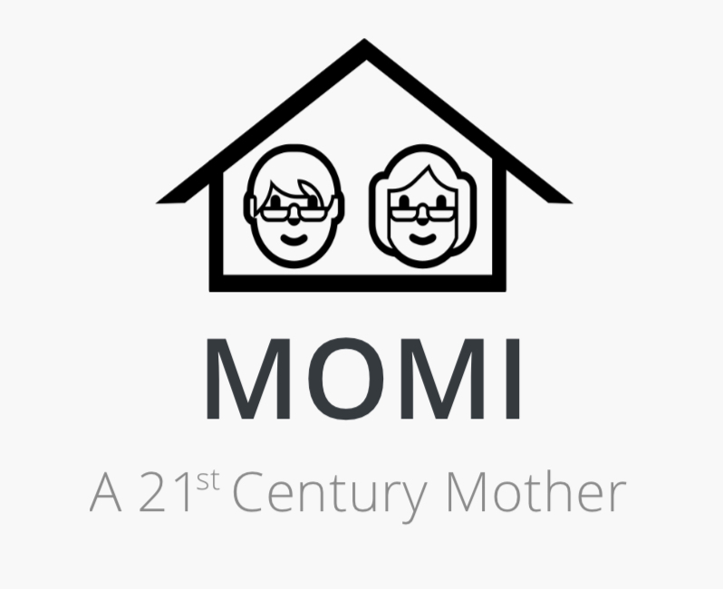
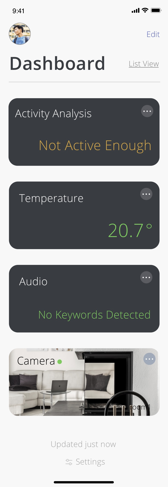
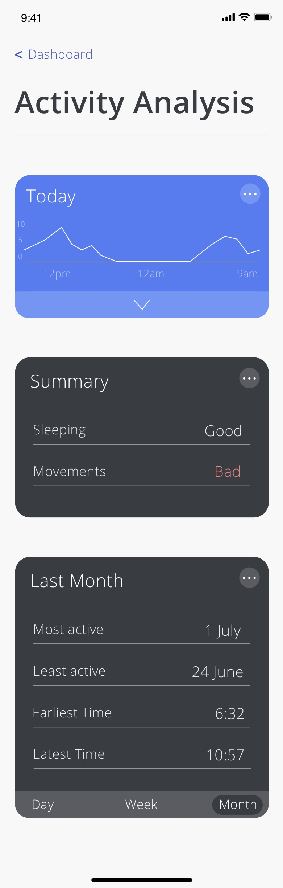

# DEVS 48-Hour Hackathon 2019

-   05.07.19 to 07.07.19
-   [DEVS 48-Hour Hackathon 2019](https://www.facebook.com/events/485201575640171/)

## Team

### Name

-   We Know Nothing

### Members

-   samnoh
-   [mingumckevin](https://github.com/mingumckevin)
-   [sunnykath](https://github.com/sunnykath)
-   [kwan574](https://github.com/kwan574)

## Project

### Name

-   MOMI
    -   Looking After Your Loved Ones
    -   A 21st Century Mother

### Intro

-   IoT for elderly people
    -   Motion sensors, thermal sensors and camera
-   Subscription business model

### Prototype Screenshots

